# 2024-02-07
Today we met with the graduate student team from the ABE department who pitched our project.  They showed us their balance and gave us a demonstration of how it worked, as well as talked a bit about the physics and calculations behind it.  They also pointed us to a helpful reference that they used to build their project, the original NIST paper, which I believe will be very helpful in the design and creation of our device
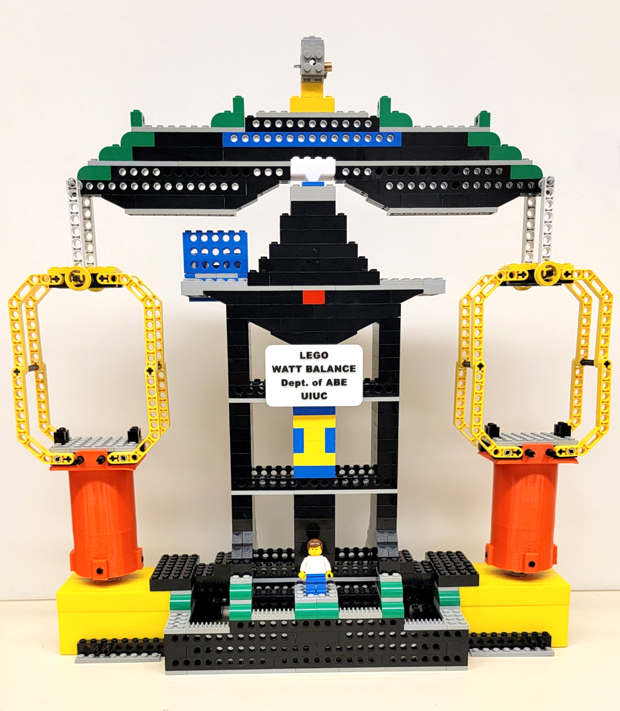
I created a GitLab repository so we could store all of our notebooks and future code and design information
We also started working on our proposal, as the deadline is already fast approaching.
# 2024-02-08
Today we all worked on the proposal and got it finished up in time to submit to the web board before the deadline.  We also finished up our RFA and submitted it to the web board.  Additionally, we also filled out our team contract.  Even though none of us know each other going into the project, I think we will work well as a team.  We also created a block diagram to go in our proposal document 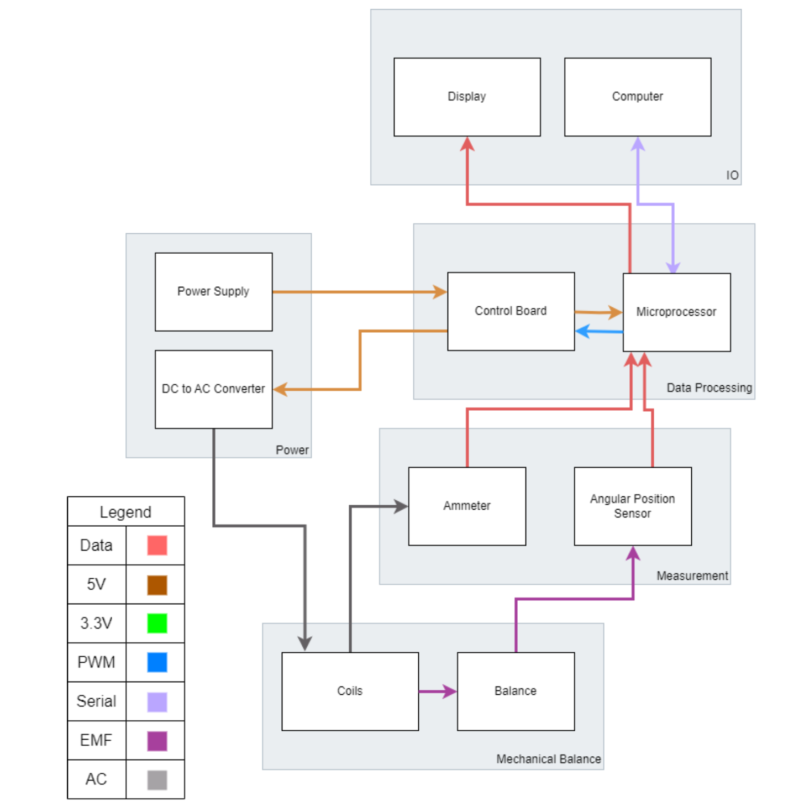
# 2024-02-15
Today we met with the TA for the first time.  She helped give us a bit more background about the project and what it entails.  She also gave us some feedback about things we needed to change on our proposal document, and said that we can resubmit it next week for some points back
# 2024-02-22
We haven't done much work in the last week, but today we started on the design document to get that started, and also did a bit more work on the proposal revision.  Because the gravitational constant is a key part of our calculations, I also did some research on what the local gravitational constant is in Champaign, as it can vary sligtly from place to place, but the best I could find was some [measurements from the 1980s](https://van.physics.illinois.edu/ask/listing/223), which should still be roughly accurate today.  
# 2024-03-04
Today we had a big meeting to pick all the different components we would use in the project.  I was in charge of finding the Hall effect sensor we would use for angular position measurements, and I found [this sensor](https://p3america.com/erck-05spi-360/), which I believe should work well for our purposes
# 2024-03-05
Today I started on the CAD design of the balance, which will be my main goal on the project for a little bit, as it is something that I have experience with that my teammates do not.  So far, this is what I have in the design:
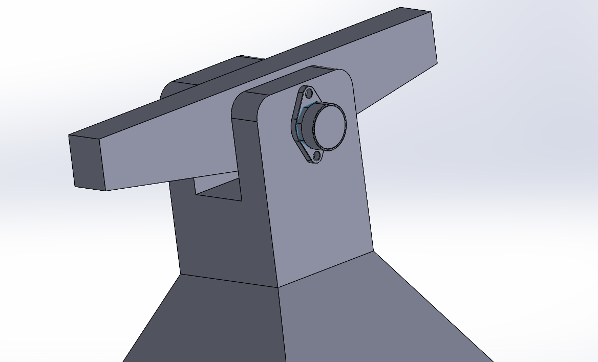
The dimensions are somewhat temporary until we do a bit more work on the design side to figure out what they should be, but I am quite happy with the general shape.  Fortunately, the Hall effect sensor has a CAD model on its website, so I don't have to make one myself.
# 2024-03-17
I've done some more work on the CAD to try to get it into a more completed state.  Some of the changes include
- Making the baskets
- Getting more finalized dimensions
- Planning for 3d printability
- Creating hooks to mount the baskets on

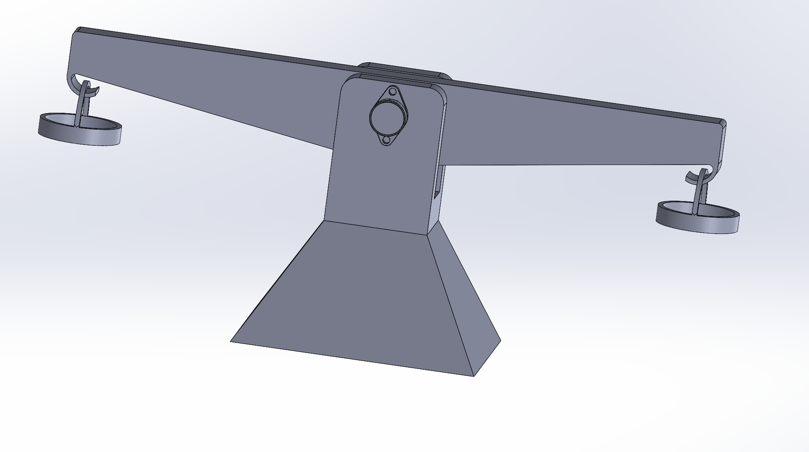
I also modeled out a bit of the motion path of the balance as it swings, and I believe we should be alright with setting fixed coils below the buckets
# 2024-03-24
Today we finalized all of the parts we plan to use in the project and placed the order.  I found this [USB to UART](https://www.mouser.com/c/semiconductors/interface-ics/usb-interface-ic/?standard=USB%202.0&type=Bridge%2C%20USB%20to%20UART) IC that should work nicely for our purposes, as well as some [magnet wire](https://a.co/d/4URU0I1) and [magnets](https://a.co/d/9Svq8fp).  Here is a list of everything we need for the project:
Physical needs:
- Bearings
- Wire for coils
- USB-C cable
- Shaft(s) (and maybe collars)
- Plastic for printing
- Magnets

Electronics Needs:
- Microprocessor
- USB-C jack
- Current Sensor
- Hall Effect Potentiometer
- Resistors, capacitors, etc
- Wire
- 7 segment display
- Usb to uart

# 2024-03-26
Today I didn't do much work on the balance, but I did order some of the additional components we need, like bearings, a shaft, and some extra magnet wire in case we need more

# 2024-03-27
Today I finished up my individual progress report.  It is quite long, and contains a lot of the information from previous notebook entries.

# 2024-04-10
Today, our PCBs finally arrived.  We have been waiting a long time for them, but we should now be ready to start soldering and assembling
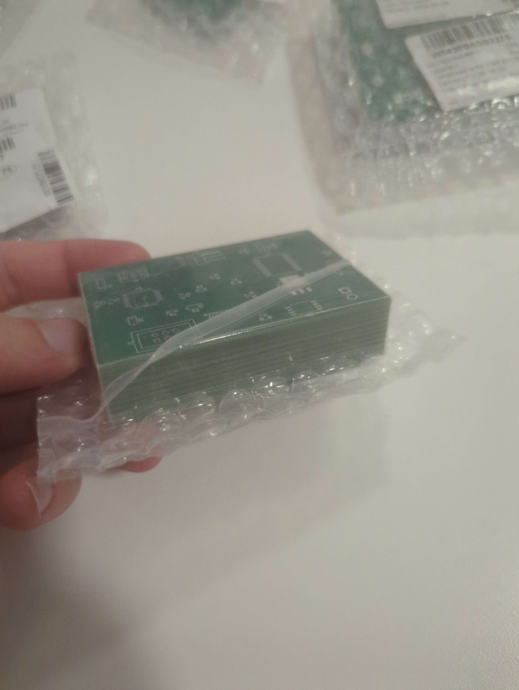

# 2024-04-16
Over the past few days, I have been printing out the parts for our balance, and I have now assembled all of them to test out how the motion works.  It swings super smoothly, the bearing is great!

I also decided that 8 of the second largest size of magnets on each side should be good to have the strength and size ratio we want

# 2024-04-18
Today I unwound the magnet wire from the spool it came on and wound it onto some custom spool holders I printed that should be the right size for our purposes.  It took quite a while, as there are several hundred windings, but I eventually got it done.  I am glad we decided to get a spare spool of wire just in case, because each holder takes a full spool of wire, so we wouldn't have had enough otherwise
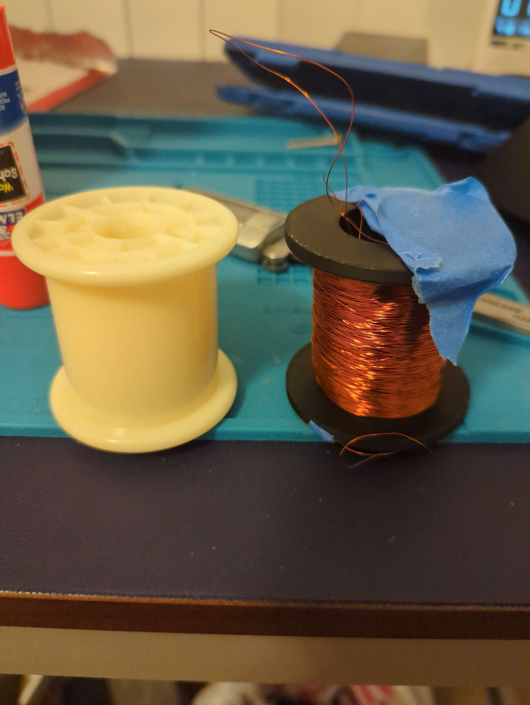
I also soldered everything onto our PCB except for a few components that are still yet to arrive.  It is looking good!

# 2024-04-19
Today I soldered a bunch of stuff onto the new PCB we designed that should work much better than the old one.  We accidentally made a mistake in the PCB design though and put the current sensor in parallel, not series, so I had to make a few modifications with jumper wires
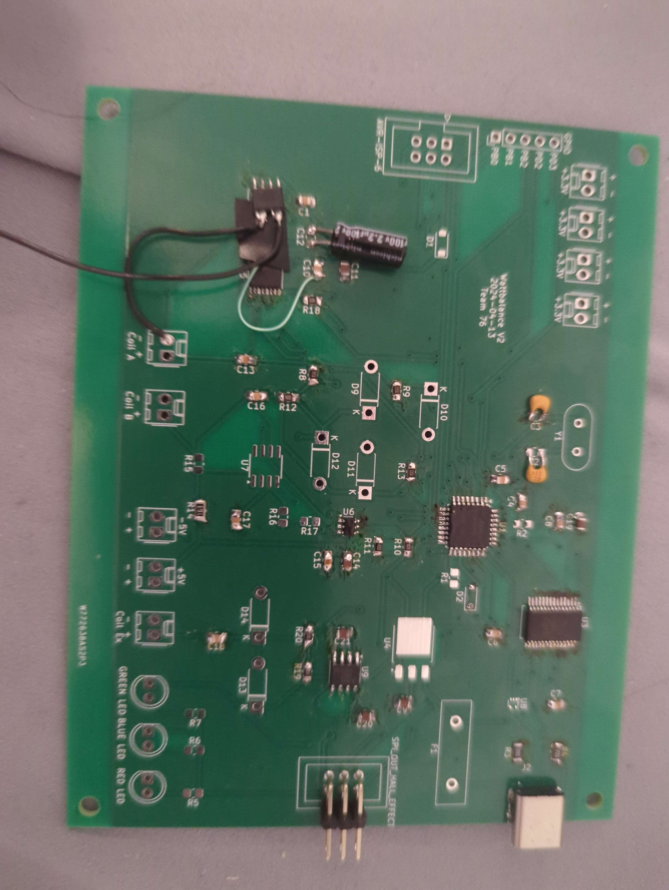

# 2024-04-20
Today I soldered on some more of the components that we got including a fuse.  We didn't have a fuse holder though, so I eventually just wound up soldering the two ends of the fuse directly to some wires.  It may not be easy to replace, but hopefully it should still work
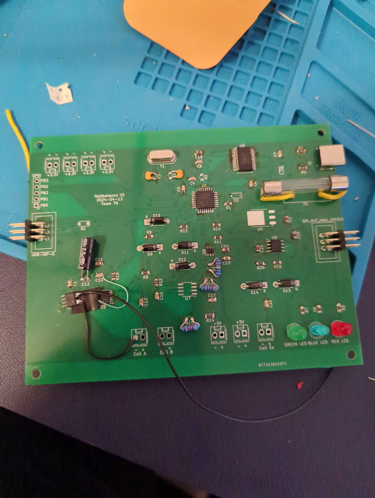

# 2024-04-21
Today I finished a major redesign of the base of the balance to house the larger PCB.  I also spent a lot of time making cutouts for our front IO, which required a lot of iterations of tests to get to fit just right, but I eventually got it
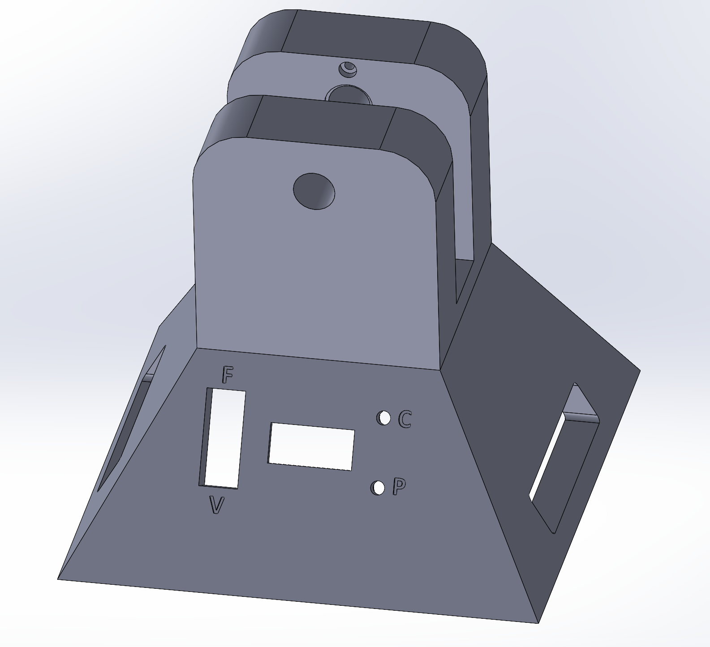
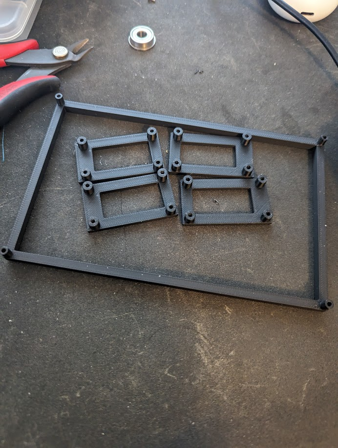
It is printing out right now, so hopefully it works, as I am using up the last of the printer filament we have.

The print just finished, and it looks great!  The front io fits super well
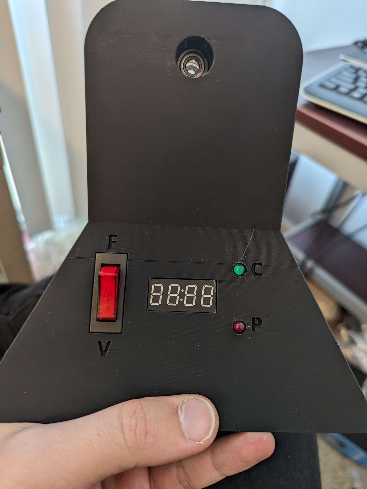

# 2024-04-26
Today I took some test data from the position sensor now that we finally have it working (after our demo unfortunately).  We had a lot of problems getting the SPI interface to work, since it is non standard and not very well documented, but we eventually iterated through every possible combination of settings until we found one that works.  Here is what the data looks like, it is quite smooth!
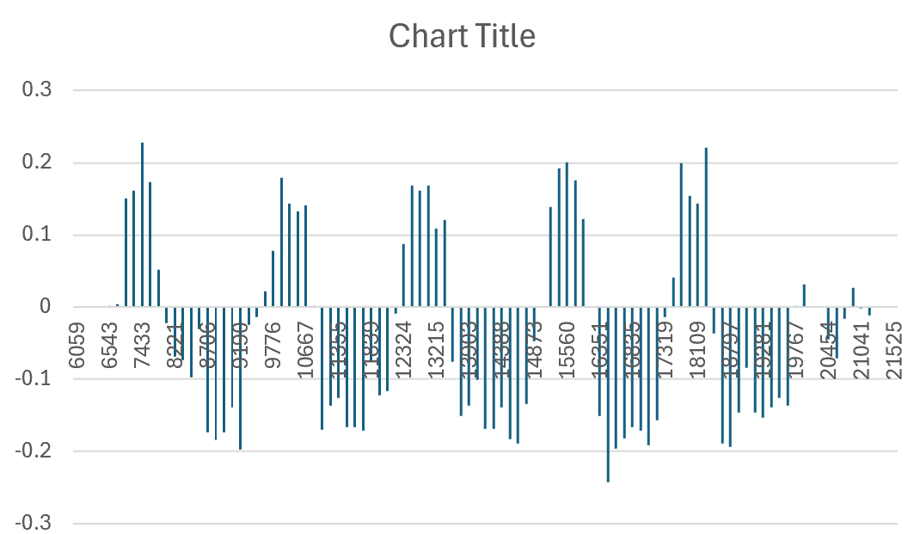

# 2024-04-28
After our data collection session today, I made a bunch of graphs of the data to include in our presentation and final report, like these two.  I think they came out well!

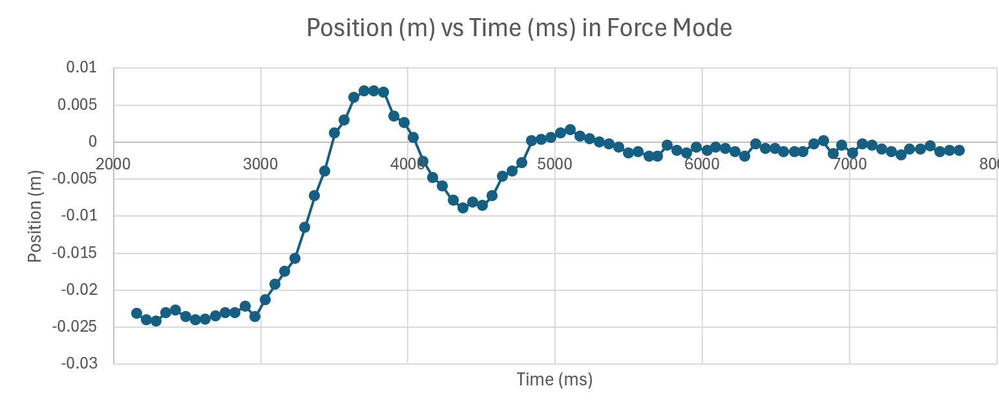
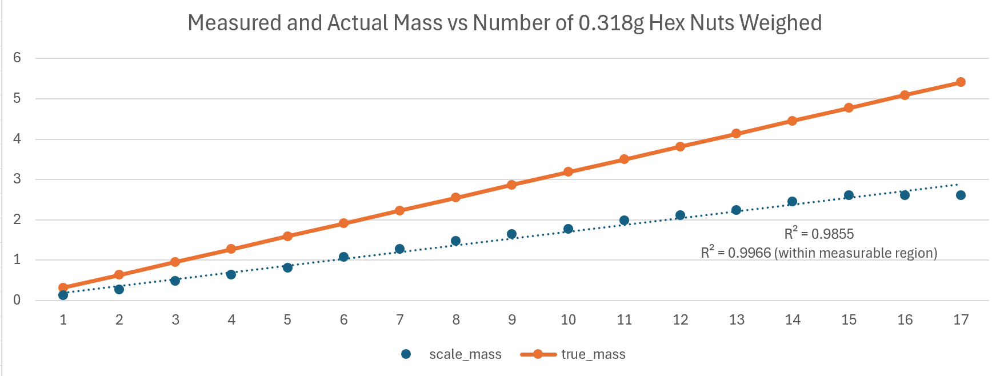
The rest are in our presentation!

# 2024-04-28
Today we gave our presentation, and while we weren't able to collect all the data we wanted due to having to switch to the Arduino, it still went pretty well.  We invited the graduate team from the ABE department that pitched the project in the first place, and they seemed quite impressed!

# 2024-05-01
Today we finished up the last part of our project, the final report.  Overall, I was quite happy with this project even if there were some areas that could be improved!