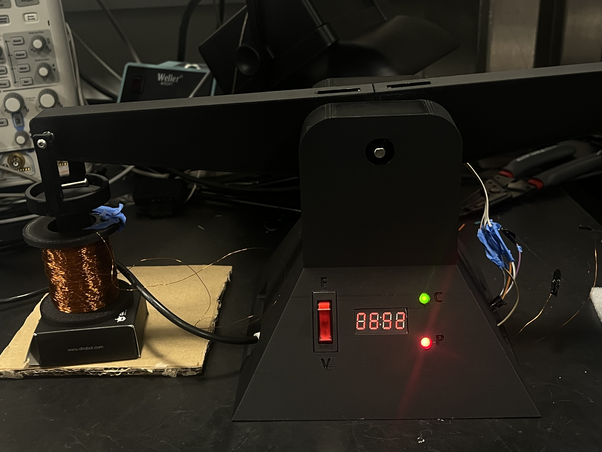

# ECE445-Wattbalance

## Introduction
Our senior design project focused on the development of a Kibble balance, also known as a watt balance. This is an instrument capable of precise measurements based on electromagnetic forces and the definition of a kilogram based on fundamental constants. Our design is focused on the two main working modes of a watt balance, velocity mode in which a coil constant is calculated, and force mode in which that coil constant is used to realize some mass. We designed a custom 3D printed balance, along with a custom PCB to drive the measurements. Once assembled we found that velocity mode on our balance was inaccurate, but our force mode performed as expected. With a manual estimation of the coil constant, we were able to get accurate mass readings from our balance. The designs, failures, and successes are all documented in the following report.

## Features
- **Custom 3D Printed Balance**: Designed for precise measurements.
- **Custom PCB**: For accurate measurement and control.
- **Velocity Mode**: Calculates the coil constant.
- **Force Mode**: Uses the coil constant to measure mass accurately.
- **Manual Estimation**: Allows for accurate mass readings.

## Read More
For more detailed information view:
- [Proposal](Documentation/proposal2.pdf)
- [Design Document](Documentation/design_document1.pdf)
- [Final Presentation](Documentation/other1.pdf)
- [Final Report](Documentation/final.pdf)
